# Stock Price Movement Forecast demo
A technology demonstration of stock price forecast software using machine learning techniques.  Multiple companies' stock prices are forecasted in this demonstration.  Different companies' data can be used for analysis and forecast purposes.

Using the most updated stock price data, the close prices for upcoming 4 trading days are forecasted.  Forecast results are updated daily before the next trading day.

S&P500 ETF Trust (SPY)
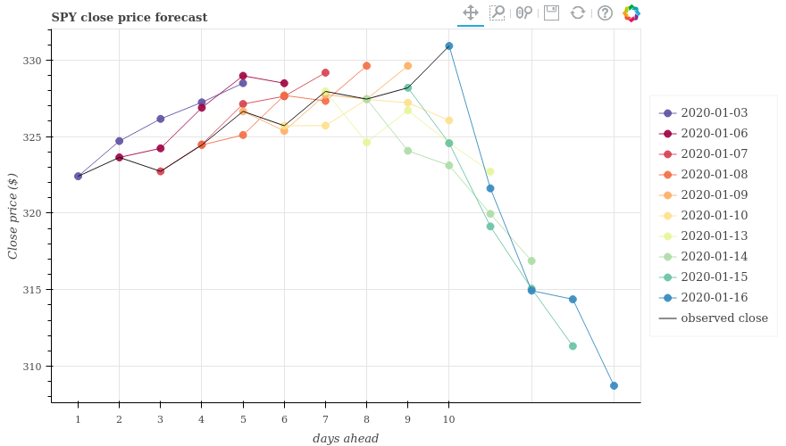

Apple (AAPL)
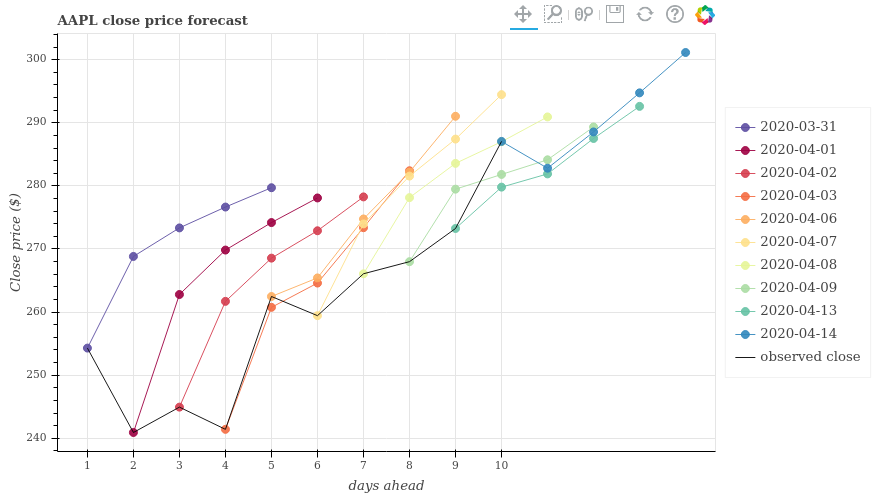

Cisco Systems (CSCO)
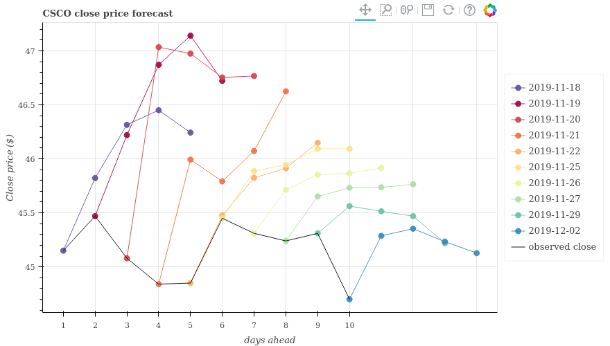

General Electric (GE)
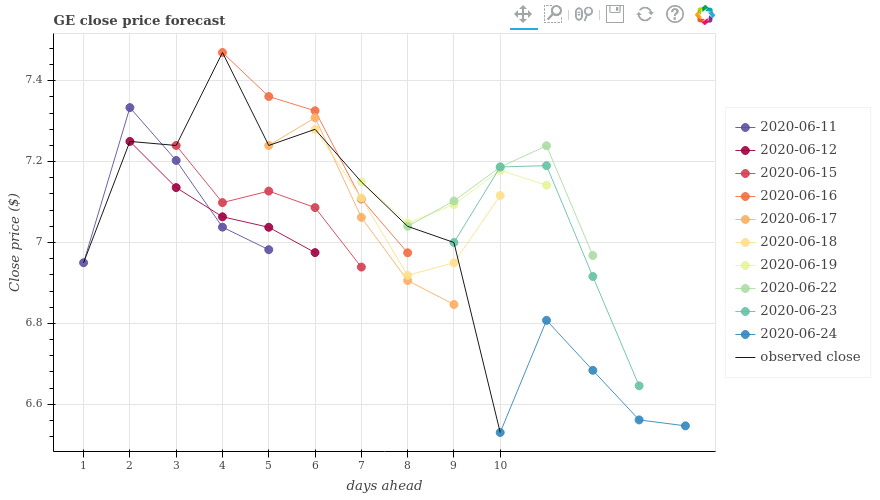

Intel Corp (INTC)
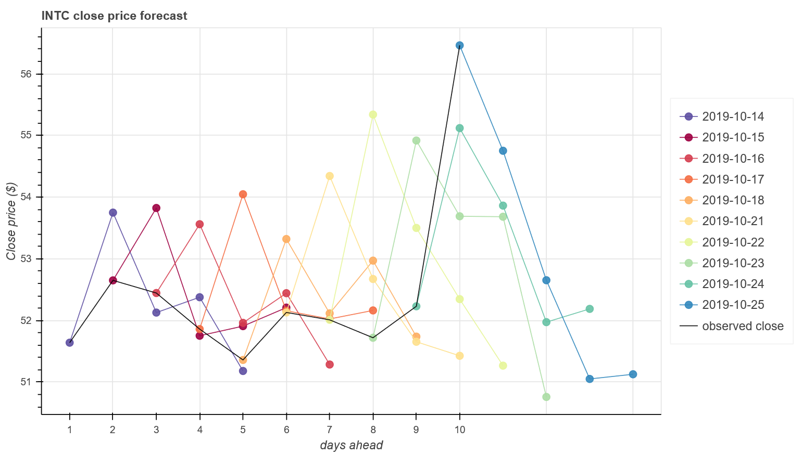

JP Morgan Chase (JPM)
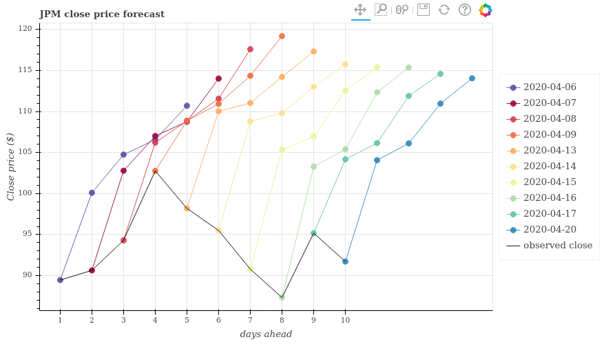

Microsoft Corp (MSFT)
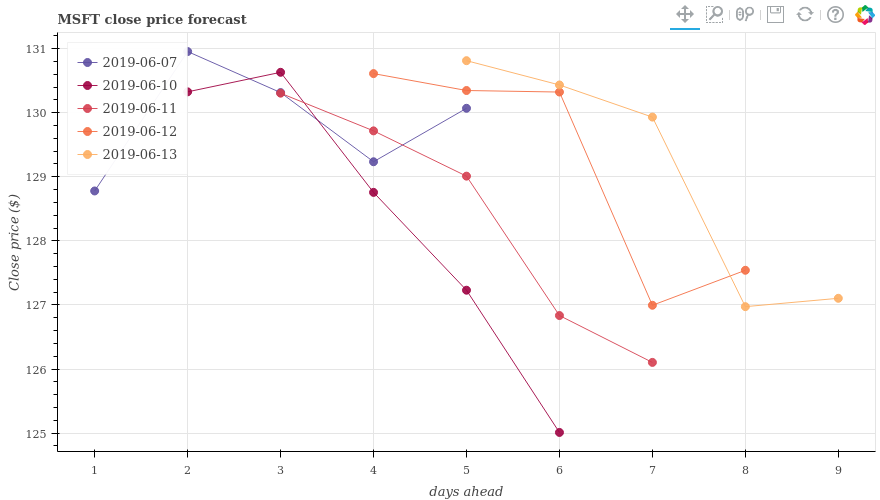

Morgan Stanley (MS)
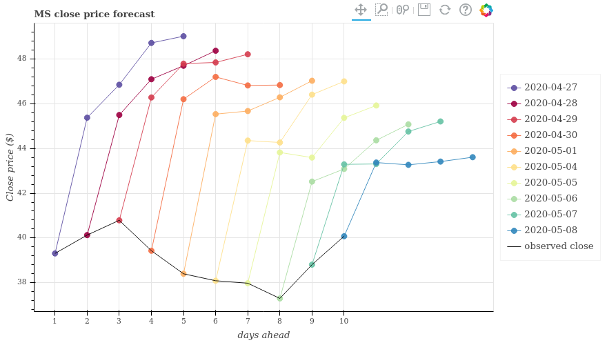

Micron Technology (MU)
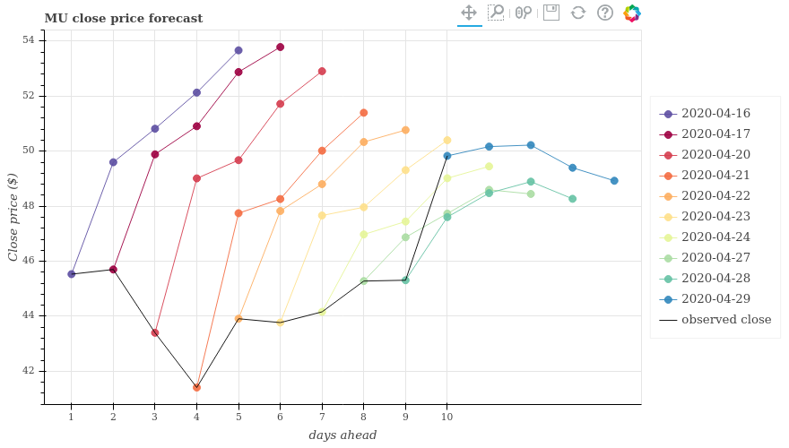

Neogenomics (NEO)
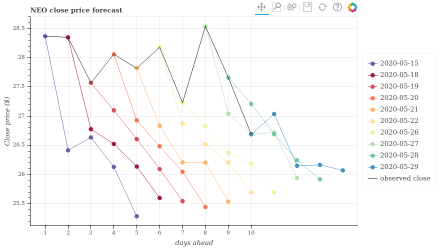

NVIDIA Corp (NVDA)
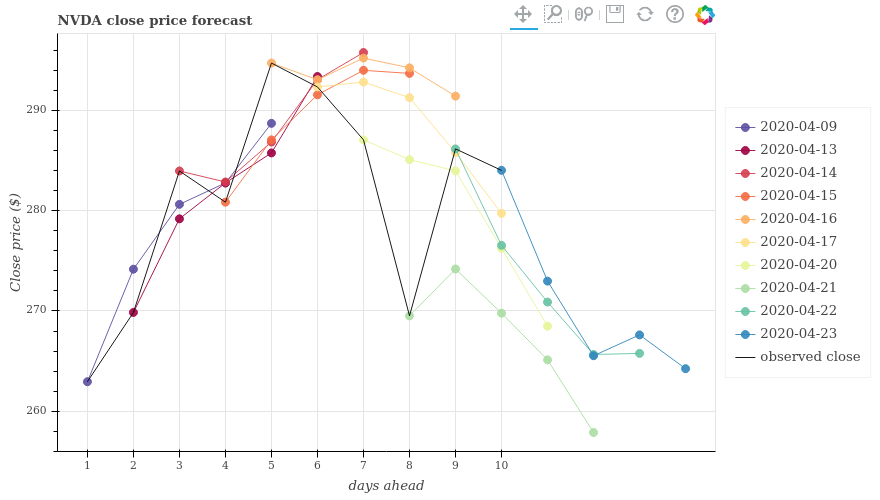

Owen and Minors (OMI)
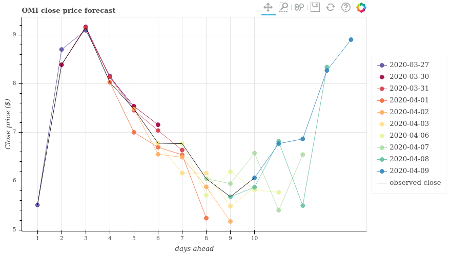

Qualcom (QCOM)
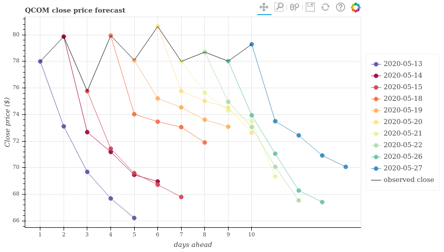

Verizon Communications (VZ)
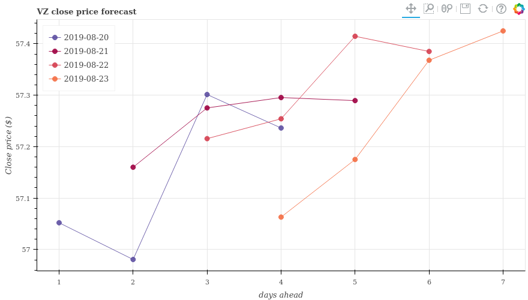

Wells Fargo Corp (WFC)
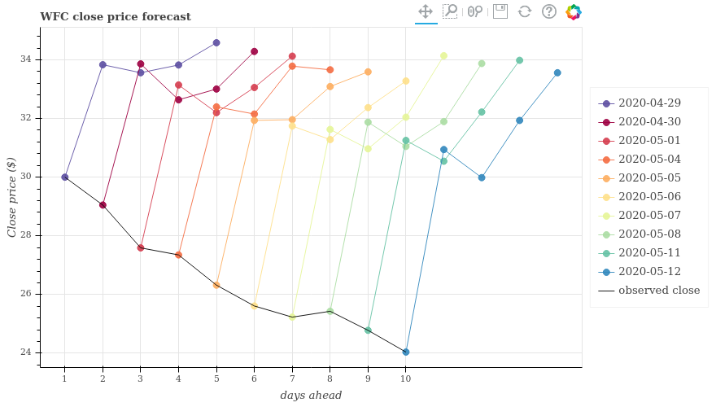
